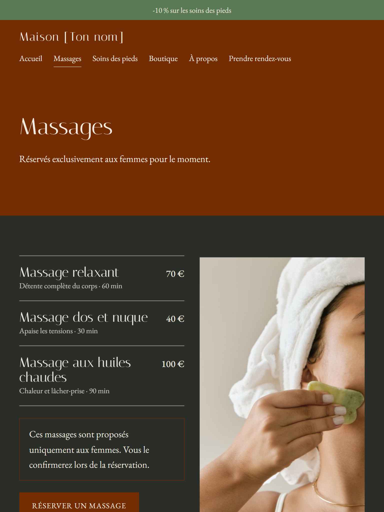
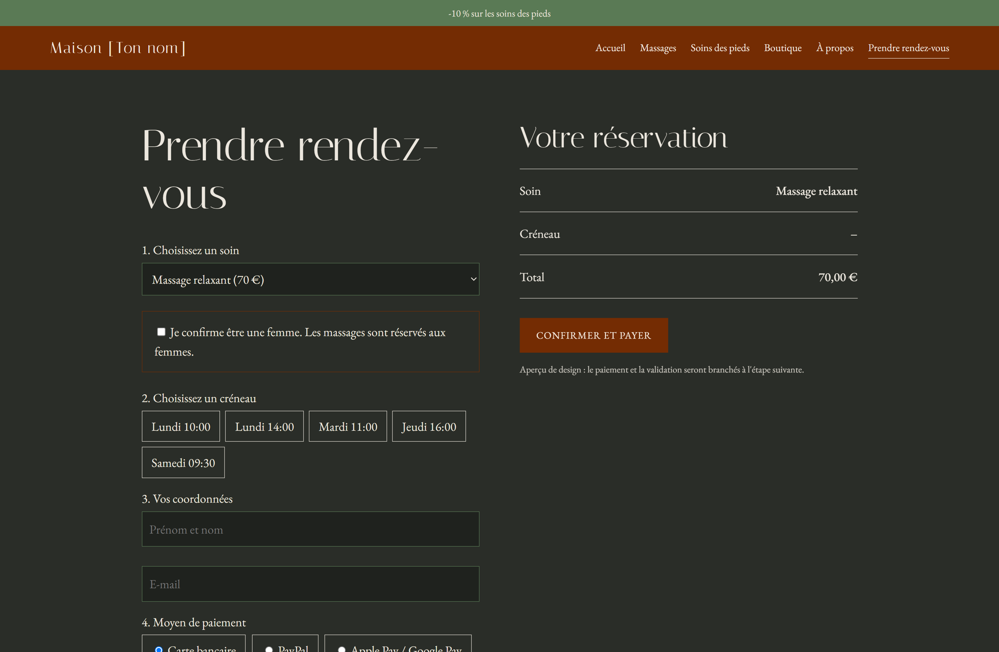

# Site de massages et soins des pieds

Maquette responsive d'un site de réservation : 6 pages, choix de créneaux,
promotions activables, paiement simulé. HTML, CSS et JavaScript, sans framework.

Voir le site en ligne : https://github.com/Emmvnuela/site-massages-pieds.git

## Aperçu

## Fonctions
- Navigation entre pages (accueil, massages, soins des pieds, boutique, à propos, réservation)
- Réservation avec créneaux et récapitulatif
- Promotions activables et désactivables
- Affichage adapté aux téléphones et mode sombre

## Note
Il s'agit d'une maquette de design : le paiement et la gestion des créneaux sont simulés.
